# NewtonEDMS — User Manual

NewtonEDMS is an enterprise document management system: capture documents,
organize them in folders, search everything (including OCR'd text), control
access, run review workflows, share securely, and keep a full audit trail.

This manual walks through everyday tasks with screenshots of the running
application. It applies to the current release (People management, share
permission levels, document signing, ownership transfer).

**Contents**

1. [Signing in](#1-signing-in)
2. [The workspace](#2-the-workspace)
3. [Browsing folders and documents](#3-browsing-folders-and-documents)
4. [Uploading documents](#4-uploading-documents)
5. [The document inspector](#5-the-document-inspector)
6. [Versioning and check-out](#6-versioning-and-check-out)
7. [Sharing documents](#7-sharing-documents)
8. [Signing a document](#8-signing-a-document)
9. [People: address book, users, groups](#9-people-address-book-users-groups)
10. [Search and the query language](#10-search-and-the-query-language)
11. [Tasks, calendar, messages](#11-tasks-calendar-messages)
12. [Personal settings](#12-personal-settings)
13. [Administration](#13-administration)
14. [Keyboard shortcuts](#14-keyboard-shortcuts)

---

## 1. Signing in

Open the NewtonEDMS URL in your browser. Enter the username and password your
administrator gave you and click **Sign in**.

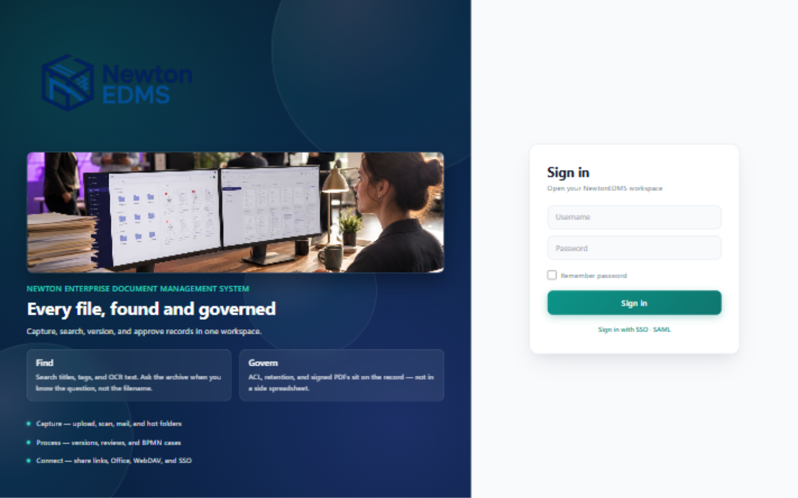

- If your account has two-factor authentication (TOTP) enabled, a code field
  appears after you enter your credentials — type the 6-digit code from your
  authenticator app.
- Your organization may also offer single sign-on links (SSO / SAML) below the
  sign-in button.
- Forgot your password? Contact your administrator; passwords are stored
  hashed and cannot be read out by anyone.

After signing in you land on the dashboard overview.

## 2. The workspace

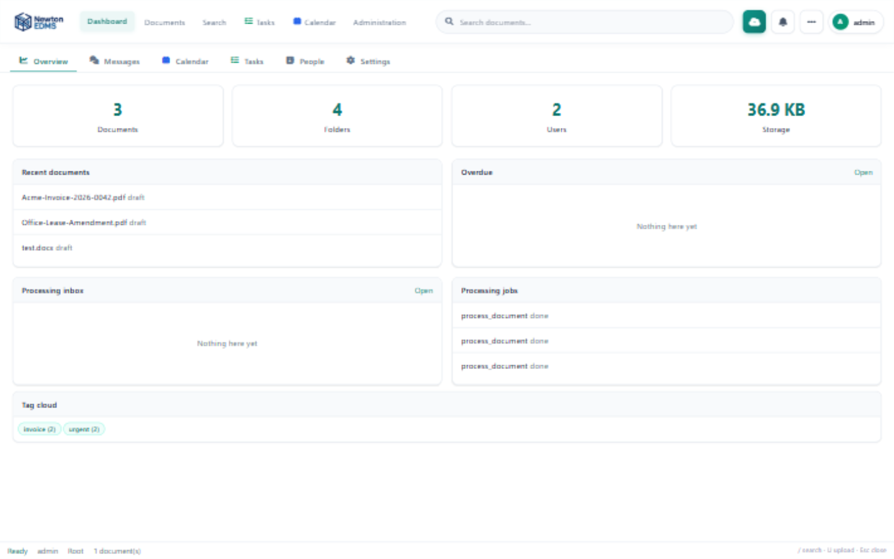

The dashboard is your landing page: recent activity, your tasks, due dates,
and quick access to saved dashboards. Along the top of every page you will
find:

| Area | What it does |
|---|---|
| **Dashboard / Documents / Search** | Switch between the overview, the folder browser, and search. |
| **Search box** | Full-text and query-language search (`/` jumps here). |
| **Upload** (⬆) | Upload documents from anywhere (`U` is the shortcut). |
| **Tools** (⋯) | Scanner capture, folder creation, exports, saved searches. |
| **Account menu** (your avatar) | Settings, theme toggle, sign out. |

## 3. Browsing folders and documents

Click **Documents** to open the repository browser.

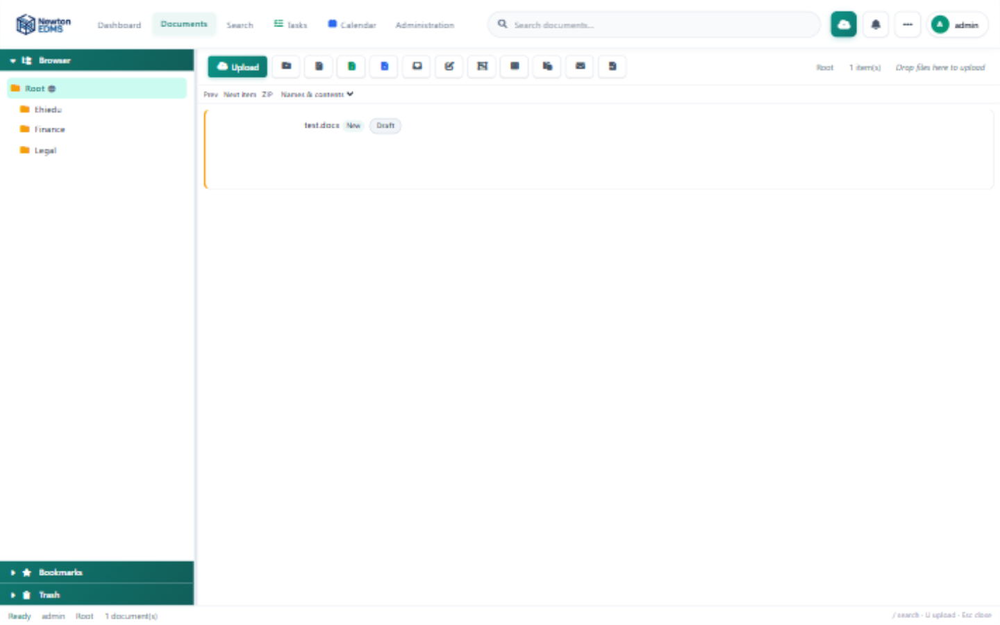

- **Left — folder tree.** Click a folder to open it. Selecting a folder also
  reveals folder tools: **New** (subfolder), **Rename**, **Security** (access
  control), and **Delete**.
- **Top — toolbar.** Upload, export the folder as ZIP or styled Excel/Word
  reports, open your processing inbox, bulk-edit or merge selected items, and
  switch between list and tile views.
- **Middle — document list.** Each card shows the title, status, tags, and
  extracted correspondents. Click a document to open it in the inspector
  (right panel).
- **Drag and drop** files anywhere onto the list to upload them into the
  current folder.

An open folder with documents looks like this:

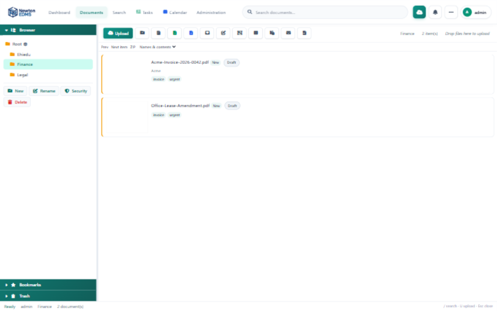

Notice the automatically suggested correspondent (*Acme*) and tags
(*invoice, urgent*) — the processing pipeline reads your documents and
proposes metadata, which you can accept or change.

## 4. Uploading documents

Click **Upload** in the header or the toolbar.

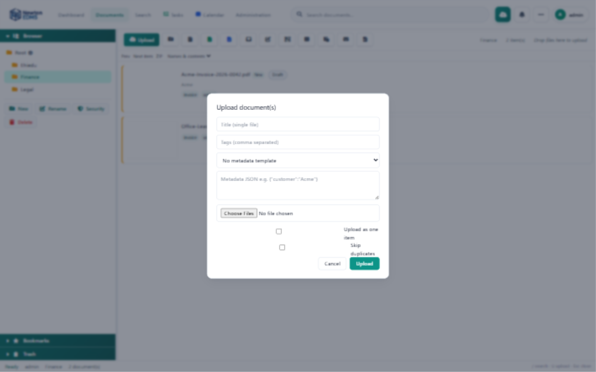

| Field | Purpose |
|---|---|
| **Title** | Used when uploading a single file. |
| **Tags** | Comma-separated tags applied on upload. |
| **Template** | Optionally apply a metadata template (custom fields). |
| **Metadata JSON** | Extra custom fields, e.g. `{"customer": "Acme"}`. |
| **Upload as one item** | Combines multiple selected files into a single multi-file item. |
| **Skip duplicates** | Files with an already-known content hash are ignored. |

After upload, the background processor automatically: keeps the untouched
original, computes the content hash, extracts text (OCR for scans), suggests
tags/contacts/dates, and adds the document to the search index.

## 5. The document inspector

Click any document to open the inspector on the right — your control center
for a single document.

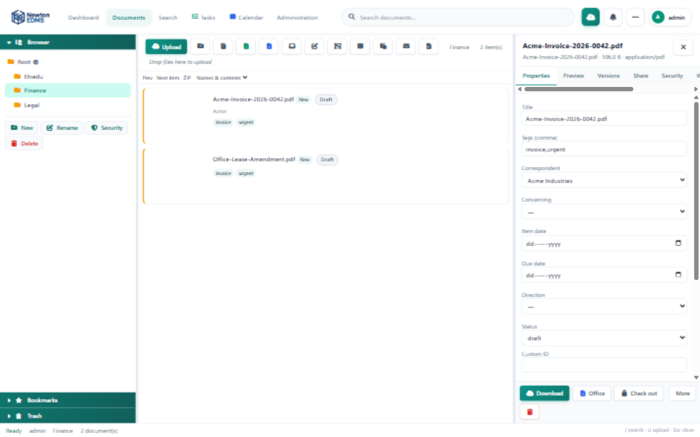

The inspector is organized into tabs:

| Tab | What you can do |
|---|---|
| **Properties** | Rename, set status/tags/rating, edit custom fields. |
| **Preview** | In-browser preview (PDF, images, text). |
| **Versions** | Version history, add a version, restore (see §6). |
| **Share** | Share links with permission levels, internal grants, ownership transfer (see §7). |
| **Security** | Fine-grained access bits (read, write, delete, download…). |
| **Workflow** | Start a review workflow on the document. |
| **PDF / Sign** | Watermark, stamp, and digital signatures (see §8). |
| **More** | Notes/comments, links, history, aliases, subscriptions, attachments. |

The footer has quick actions: **Download**, **Office** (desktop/online
editing), **check-out/in** (🔒), and **Delete**.

## 6. Versioning and check-out

Every change that replaces a file creates a new **version**. Nothing is
overwritten — earlier versions remain downloadable.

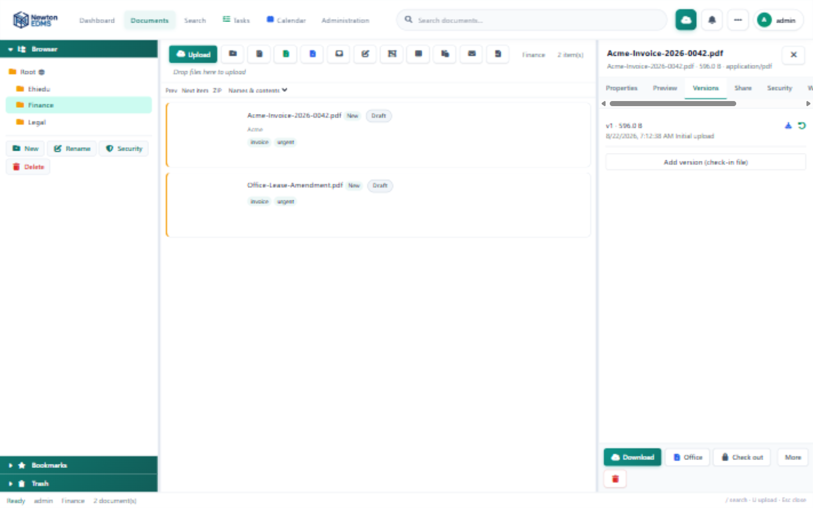

- **Add version**: upload a new file as the next version; you are prompted
  for a version comment (for example, "Revised payment terms").
- **Restore**: roll back to an earlier version — the current file is itself
  preserved as a new version, so restores are never destructive.
- **Check-out / check-in** (🔒 in the inspector footer): lock a document
  while you work on it. Other users with edit rights cannot replace the file
  until you check it back in.

## 7. Sharing documents

Open the **Share** tab in the inspector.

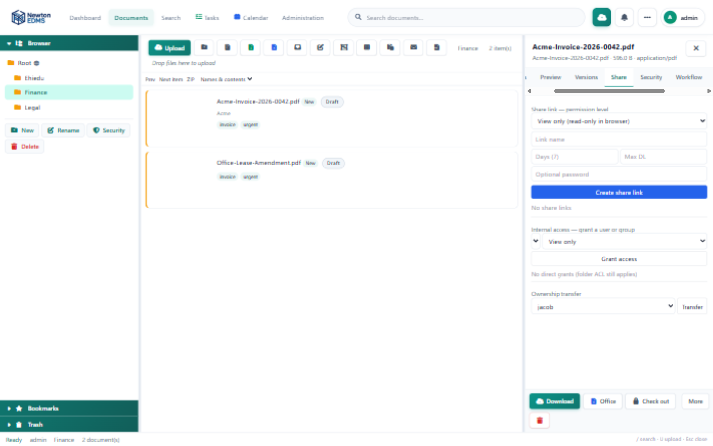

### Share links (external people, no account needed)

Create a link with a **permission level**:

| Level | What recipients can do |
|---|---|
| **View only** | Open a web page that shows the document in the browser. No download. |
| **View & comment** | The same page plus a comment box — reviewers type their name and comment; comments land in the document's Notes tab, marked *via share*. |
| **Download** | Classic download link with an optional download counter. |

Every link can carry an **optional password**, an **expiry date** (default
7 days), a **download cap** (download links), and can be **revoked** at any
time. View/comment pages show PDFs and images inline; other file types offer
download links only.

### Internal access (accounts and groups)

Below the link section, **Internal access** grants a specific user or group
**View only** or **Edit** rights on the document — ideal for "share with
finance" scenarios. Grants appear as chips and can be revoked with one click.

### Ownership transfer

The **Ownership transfer** section (visible to the owner and administrators)
hands the document to another user. The new owner takes over any open
check-out; you stop being the owner. Useful when people change roles or
leave the organization.

## 8. Signing a document

Open the inspector's **PDF / Sign** tab.

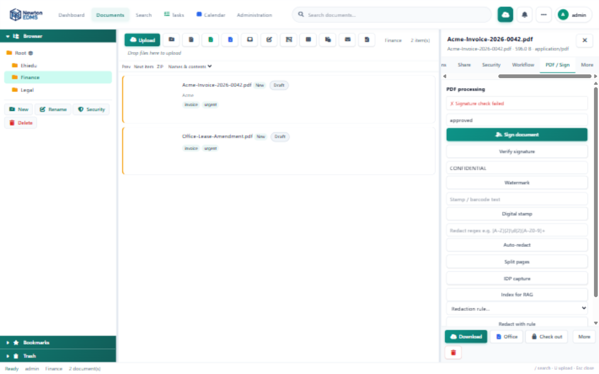

- The status box shows whether the document is already signed, by whom, and
  when.
- Enter a **reason** (e.g. "Approved for payment") and click
  **Sign document**. NewtonEDMS applies a visible signature stamp and embeds
  a cryptographic PAdES signature in the PDF.
- **Verify signature** re-checks the embedded signature at any time.
- The same tab offers **Watermark**, **Digital stamp**, **Auto-redact**
  (regex-based), **Split pages**, and **IDP capture** (zonal data capture).

## 9. People: address book, users, groups

Open **Dashboard → People**. The page has up to three sub-tabs (users and
groups are visible to administrators only).

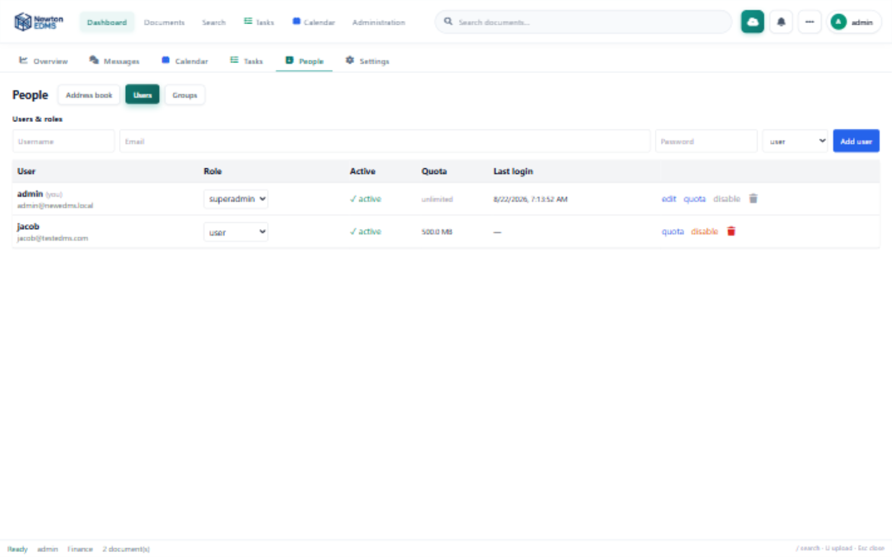

**Users & roles**

- **Add user**: username, email, initial password, and role
  (`user`, `manager`, `admin`, `superadmin`).
- Each row shows the role (editable drop-down), active/disabled state,
  **storage quota**, and last login.
- Actions: **quota** (set a storage cap in MB; 0 = unlimited),
  **disable/enable** (blocks login without deleting anything), and
  **delete** (blocked for accounts that own content — deactivate instead).
- For your own account the disable/delete buttons are intentionally locked:
  deactivating yourself would lock you out.

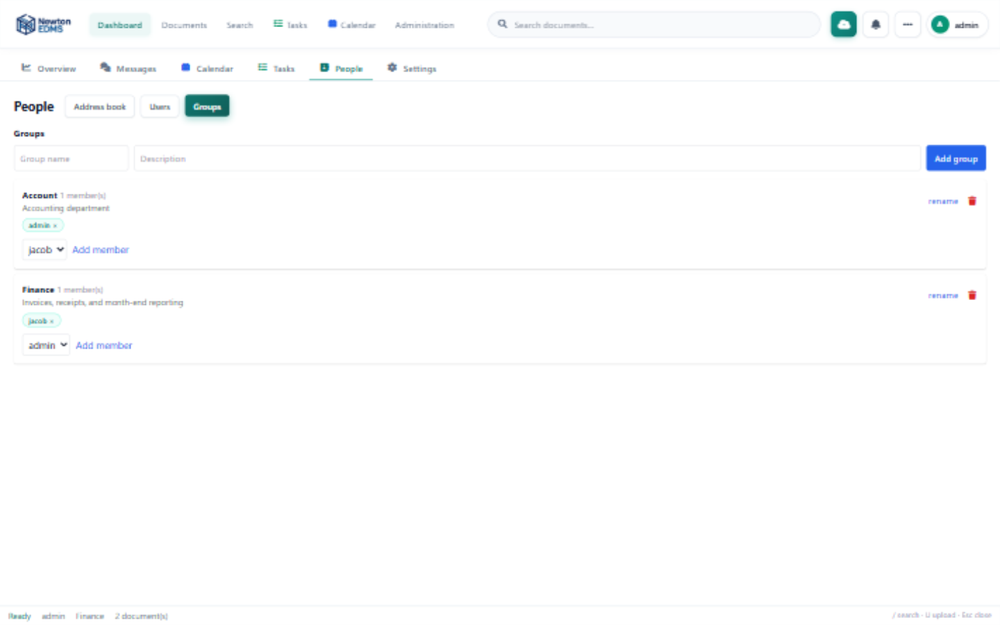

**Groups**

- Create groups with a name and description (e.g. *Finance*).
- Add members from the drop-down; members show as removable chips.
- Groups can be granted folder/document permissions in the Security tab and
  internal access in the Share tab — one grant covers everyone in the group.

**Address book** (third sub-tab) manages correspondents and concerning
parties used by the capture pipeline to suggest contacts for new documents.

## 10. Search and the query language

Type in the header search box and press Enter, or use the **Search** tab for
full-text and parameter forms.

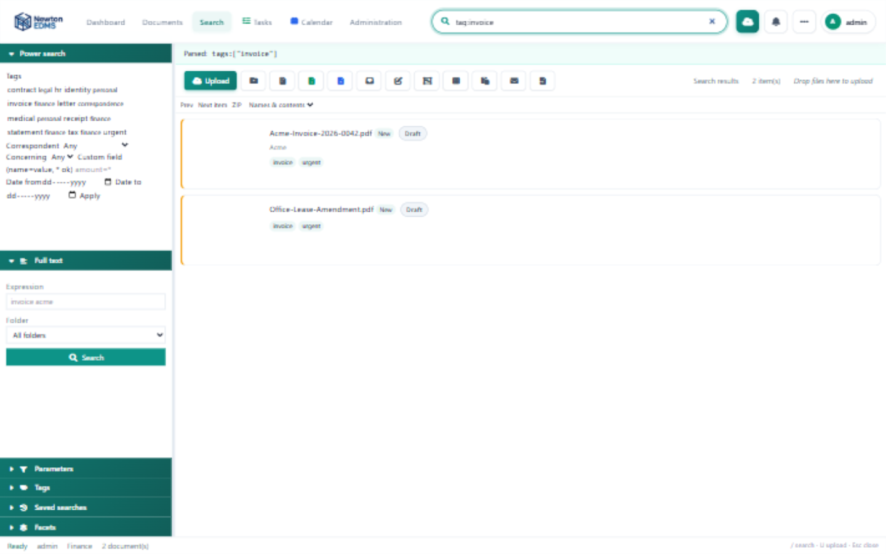

The search box accepts structured filters:

```
tag:invoice correspondent:acme due:overdue status:draft
folder:3 source:email inbox "purchase order"
```

| Field | Meaning |
|---|---|
| `tag:` | Has this tag |
| `correspondent:` / `concerning:` | Linked contact |
| `status:` | draft, review, approved, published, archived |
| `folder:` | Folder id |
| `due:` | `overdue`, `none`, or `YYYY-MM` |
| `source:` | upload, email, scan… |
| `name:` / `notes:` / `custom:` | Field search |
| `inbox` | Unprocessed items only |
| remaining words | Full-text (searches OCR'd content too) |

Save frequent searches with **Tools → Save search**; they appear under
*Bookmarks* in the folder browser.

## 11. Tasks, calendar, messages

- **Tasks** (bell icon / Dashboard → Tasks): your review and approval tasks.
  Approve or reject with an optional comment.
- **Calendar**: due dates, retention events, and your own entries.
- **Messages**: internal messages between users.

## 12. Personal settings

Open the account menu (top right) → **Settings**.

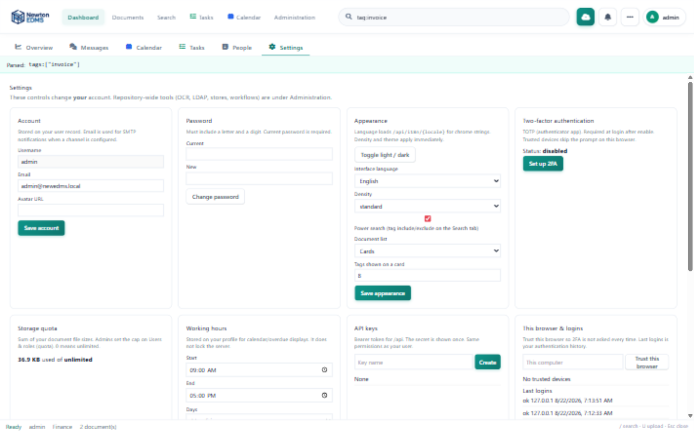

- **Appearance**: theme, language, density, avatar.
- **Two-factor authentication**: enable TOTP with any authenticator app
  (scan the secret, confirm one code).
- **Quota**: how much storage you have used.
- **API keys**: create/revoke tokens for scripted access
  (`Authorization: Bearer <key>` or `X-API-Key`).
- **Trusted devices** and recent logins.

## 13. Administration

Administrators see an **Administration** tab. The left rail groups settings:
People (users, groups, sessions), Classification (tags, fields, templates,
numbering, auto-tagging), Process (workflows, BPMN, rules, forms, IDP zones),
Ingest (hot folders, mailbox, upload URLs, CSV, scanner, backup),
Integrations (mail, Office, LDAP/SAML, connectors, protocols), Storage &
jobs (stores, OCR, index, jobs, schedules, cluster), Security & retention
(policies, holds, GDPR, redaction, audit, compliance), and Sharing &
insights (share links, notifications, reports, RAG, server log).

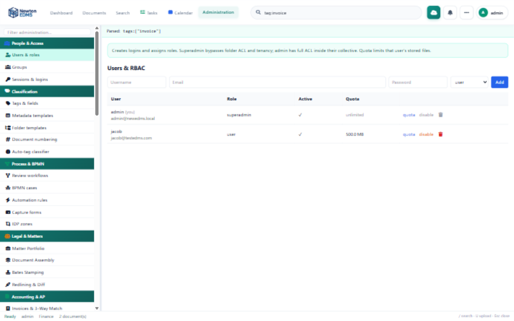

Use the filter box at the top of the rail to jump to any section.

## 14. Keyboard shortcuts

| Key | Action |
|---|---|
| `/` | Focus the search box |
| `U` | Open the upload dialog |
| `Esc` | Close the inspector / dialogs |

---

*NewtonEDMS — every file, found and governed.*
